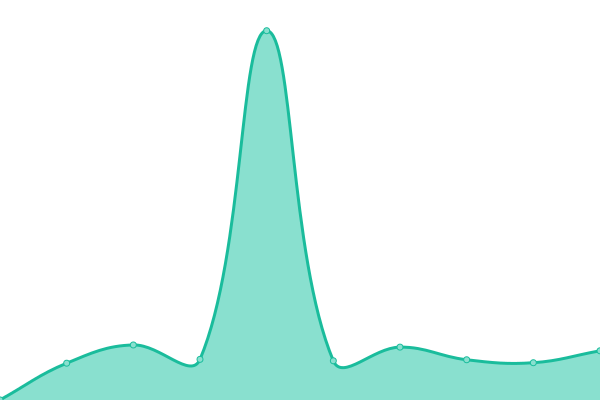

# [📈 Live Status](https://mobilitysol.github.io/monitorweb): <!--live status--> **🟩 All systems operational**

This repository contains the open-source uptime monitor and status page for [mobilitysol](https://mobilitysol.github.io/monitorweb), powered by [Upptime](https://github.com/upptime/upptime).

With [Upptime](https://upptime.js.org), you can get your own unlimited and free uptime monitor and status page, powered entirely by a GitHub repository. We use [Issues](https://github.com/mobilitysol/monitorweb/issues) as incident reports, [Actions](https://github.com/mobilitysol/monitorweb/actions) as uptime monitors, and [Pages](https://mobilitysol.github.io/monitorweb) for the status page.

<!--start: status pages-->
<!-- This summary is generated by Upptime (https://github.com/upptime/upptime) -->
<!-- Do not edit this manually, your changes will be overwritten -->
<!-- prettier-ignore -->
| URL | Status | History | Response Time | Uptime |
| --- | ------ | ------- | ------------- | ------ |
|  [Server Mobility Produccion](https://mobilitysol.com:20443) | 🟩 Up | [server-mobility-produccion.yml](https://github.com/mobilitysol/monitorweb/commits/HEAD/history/server-mobility-produccion.yml) | 

 690ms
     
 | 

<a href="https://mobilitysol.github.io/monitorweb/history/server-mobility-produccion">100.00%</a>
    

|  [Server Mobility Testing](https://mobilitysol.com:30443) | 🟩 Up | [server-mobility-testing.yml](https://github.com/mobilitysol/monitorweb/commits/HEAD/history/server-mobility-testing.yml) | 

 683ms
     
 | 

<a href="https://mobilitysol.github.io/monitorweb/history/server-mobility-testing">100.00%</a>
    

|  [Mobility Solutions Web](https://mobilitysol.com) | 🟩 Up | [mobility-solutions-web.yml](https://github.com/mobilitysol/monitorweb/commits/HEAD/history/mobility-solutions-web.yml) | 

 3003ms
     
 | 

<a href="https://mobilitysol.github.io/monitorweb/history/mobility-solutions-web">99.62%</a>
    

|  [Nextcloud Clip Uruguay](https://clip.interclip.com/nextcloud) | 🟩 Up | [nextcloud-clip-uruguay.yml](https://github.com/mobilitysol/monitorweb/commits/HEAD/history/nextcloud-clip-uruguay.yml) | 

 1274ms
     
 | 

<a href="https://mobilitysol.github.io/monitorweb/history/nextcloud-clip-uruguay">99.84%</a>
    

|  [Zulip Uruguay](https://zulip.mobilitysol.com:2443/) | 🟩 Up | [zulip-uruguay.yml](https://github.com/mobilitysol/monitorweb/commits/HEAD/history/zulip-uruguay.yml) | 

 3863ms
     
 | 

<a href="https://mobilitysol.github.io/monitorweb/history/zulip-uruguay">99.84%</a>
    

|  [Clip Connections Web](https://www.interclip.com) | 🟩 Up | [clip-connections-web.yml](https://github.com/mobilitysol/monitorweb/commits/HEAD/history/clip-connections-web.yml) | 

 1274ms
     
 | 

<a href="https://mobilitysol.github.io/monitorweb/history/clip-connections-web">99.62%</a>
    

|  [Registro de visitas Clip Uruguay](http://clip.interclip.com:8123/kimai2/public) | 🟩 Up | [registro-de-visitas-clip-uruguay.yml](https://github.com/mobilitysol/monitorweb/commits/HEAD/history/registro-de-visitas-clip-uruguay.yml) | 

 1375ms
     
 | 

<a href="https://mobilitysol.github.io/monitorweb/history/registro-de-visitas-clip-uruguay">100.00%</a>
    

|  [PizzaPiedra Web](https://pizzapiedra.com.uy) | 🟩 Up | [pizza-piedra-web.yml](https://github.com/mobilitysol/monitorweb/commits/HEAD/history/pizza-piedra-web.yml) | 

 1762ms
     
 | 

<a href="https://mobilitysol.github.io/monitorweb/history/pizza-piedra-web">99.63%</a>
    

|  [RequetePizza Web](https://requetepizza.com) | 🟩 Up | [requete-pizza-web.yml](https://github.com/mobilitysol/monitorweb/commits/HEAD/history/requete-pizza-web.yml) | 

 835ms
     
 | 

<a href="https://mobilitysol.github.io/monitorweb/history/requete-pizza-web">99.63%</a>
    

|  [PizzaRiing Web](https://pizzariing.uy) | 🟩 Up | [pizza-riing-web.yml](https://github.com/mobilitysol/monitorweb/commits/HEAD/history/pizza-riing-web.yml) | 

 1450ms
     
 | 

<a href="https://mobilitysol.github.io/monitorweb/history/pizza-riing-web">99.64%</a>
    

|  [PizzaTime Web](https://pizzatime.uy) | 🟩 Up | [pizza-time-web.yml](https://github.com/mobilitysol/monitorweb/commits/HEAD/history/pizza-time-web.yml) | 

 1114ms
     
 | 

<a href="https://mobilitysol.github.io/monitorweb/history/pizza-time-web">99.64%</a>
    

|  [Pan y Pizza](https://panypizza.uy) | 🟩 Up | [pan-y-pizza.yml](https://github.com/mobilitysol/monitorweb/commits/HEAD/history/pan-y-pizza.yml) | 

 2118ms
     
 | 

<a href="https://mobilitysol.github.io/monitorweb/history/pan-y-pizza">100.00%</a>
    

<!--end: status pages-->

[**Visit our status website →**](https://mobilitysol.github.io/monitorweb)

## 📄 License

- Powered by: [Upptime](https://github.com/upptime/upptime)
- Code: [MIT](./LICENSE) © [mobilitysol](https://mobilitysol.github.io/monitorweb)
- Data in the `./history` directory: [Open Database License](https://opendatacommons.org/licenses/odbl/1-0/)
